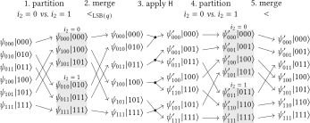

Home
####

We are excited to announce the initial public release of **qblaze**,
a new state-of-the-art open-source simulator for quantum circuits and quantum programs.

qblaze is based on a sparse state vector representation.
It is particularly suited for workloads that exhibit strong or even just moderate state vector sparsity,
while remaining competitive with traditional state vector simulators even on dense workloads.

**Performance**.
qblaze demonstrates orders-of-magnitude improvements in overall performance
against previous state-of-the-art simulators on important classes of benchmarks.
Of particular note is its ability to run circuit-level implementations of Shor’s algorithm,
simulating the factoring of 9-digit numbers in only a couple of minutes.

**Usability**.
Besides its own API (for C, Python, and Rust),
qblaze also comes with out-of-the-box support for Qiskit,
and can be used as a drop-in replacement for existing simulators.
qblaze directly implements
unitary single-qubit gates, multiply-controlled NOT/phase/SWAP gates, and measurements.

Performance comparison
======================

QASMBench
---------

.. raw:: html
   :file: plots/fig1.html.frag

We evaluated qblaze against other state-of-the art simulators on `QASMBench <https://github.com/pnnl/QASMBench>`_,
a suite consisting of over 100 circuits.
The plot shows the geometric mean of the slowdown of each simulator
relative to the fastest simulator on the corresponding circuit.
Individual runtimes are clamped to [250ms; 30min].
Overall, qblaze is the fastest simulator.

Shor
----

We also tried several versions of Shor's algorithm.

.. raw:: html
   :file: plots/fig4.html.frag

The first version of Shor's algorithm uses `ripple carry adders <https://arxiv.org/pdf/quant-ph/0410184>`_,
and a normal quantum Fourier transform (QFT).
As we can see, qblaze is again the fastest simulator.
`GraFeyn <https://github.com/UmutAcarLab/grafeyn>`_,
another multi-threaded sparse state vector simulator,
also performs well,
but it runs out of memory
when trying a 12-bit number.

.. raw:: html
   :file: plots/fig5.html.frag

Using a semi-classical QFT in Shor's algorithm
reduces the number of qubits,
and simplifies the quantum state.
In this case, there are :math:`O(N)` many non-zero elements in the state vector at any time,
where :math:`N` is the number being factored.
Many simulators performed better,
but sadly we could not evaluate GraFeyn
because it does not support simulating quantum measurements.

.. raw:: html
   :file: plots/fig6.html.frag

Finally, we ran Shor's algorithm
where `the addition itself is done with QFT <https://arxiv.org/pdf/quant-ph/0008033>`_.
In this benchmark the state vector is relatively dense,
and it heavily uses gates
that cause interference between basis states.
This makes the benchmark more difficult for sparse state vector simulators.
The number of non-zero elements in the state vector is significantly higher:
:math:`O(N^2)` when factoring :math:`N`.
From the results we see that while the two Q# simulators become unusable even for small numbers,
while qblaze still performs well.

Grover
------

.. raw:: html
   :file: plots/fig7.html.frag

Here, we take a closer look at one of the circuit families in QASMBench.
It implements Grover's algorithm.
While the problem it solves is trivial
(it computes square root in :math:`GF(2^n)`),
simulating the circuit is not.
Of all simulators we tried,
only qblaze and GraFeyn managed to finish the
largest benchmark within a reasonable time limit
(the others did not finish within hours).

Experimental setup
------------------

We performed our evaluation on a Google Cloud :code:`c3d-standard-360` instance
with 180 cores and 1440 GiB of 12-channel DDR5-4800 memory.

Technical overview
==================

The core of qblaze is implemented in Rust
and achieves its performance using highly cache-efficient data structures.
In contrast to previous sparse state vector simulators,
which often represented sparse quantum states as hash tables mapping basis states to amplitudes,
qblaze stores states in (up to two) sorted arrays of basis state-amplitude pairs.
It dynamically reorders the arrays to optimize data access patterns.
Conceptually, reordering is typically performed via partition and merge operations.

The implementation of qblaze is carefully designed
to minimize the number of passes over the memory when applying a quantum gate.
In particular, a merge operation is fused together with the subsequent computations on amplitudes,
as well as with any partition operation,
which results in a single merge-apply-partition pass over the memory.

Furthermore, all operations are parallelized.
In practice this means that on large state vectors performance is only limited
by the memory bandwidth of the system.
We provide details on the design and implementation of qblaze in
`our paper </oopsla2025.pdf>`_, published at OOPSLA 2025.

Fig. 3 from the paper, reproduced here,
illustrates how qblaze applies a (single-qubit) Hadamard gate on an unpartitioned state vector.
In practice, steps 2-4 are fused into single passes over the data,
such that only two linear, highly cache-efficient passes over the state vector are required for applying each single-qubit gate.
Similarly, step 5 of one gate is fused with step 1 of the next one.
qblaze comes with many more optimizations detailed in the paper.

Authors
=======

| Hristo Venev, `INSAIT <https://insait.ai/>`_
| Dimitar Dimitrov, `INSAIT <https://insait.ai/>`_
| Timon Gehr, `ETH Zurich <https://www.sri.inf.ethz.ch/>`_
| Martin Vechev, `ETH Zurich <https://www.sri.inf.ethz.ch/>`_ and `INSAIT <https://insait.ai/>`_
| Thien Udomsrirungruang, `INSAIT <https://insait.ai/>`_ (SURF internship)
